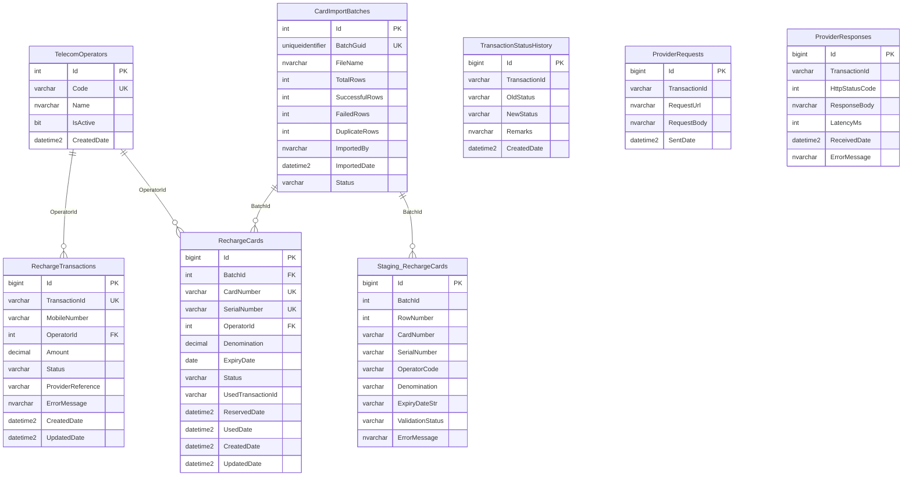
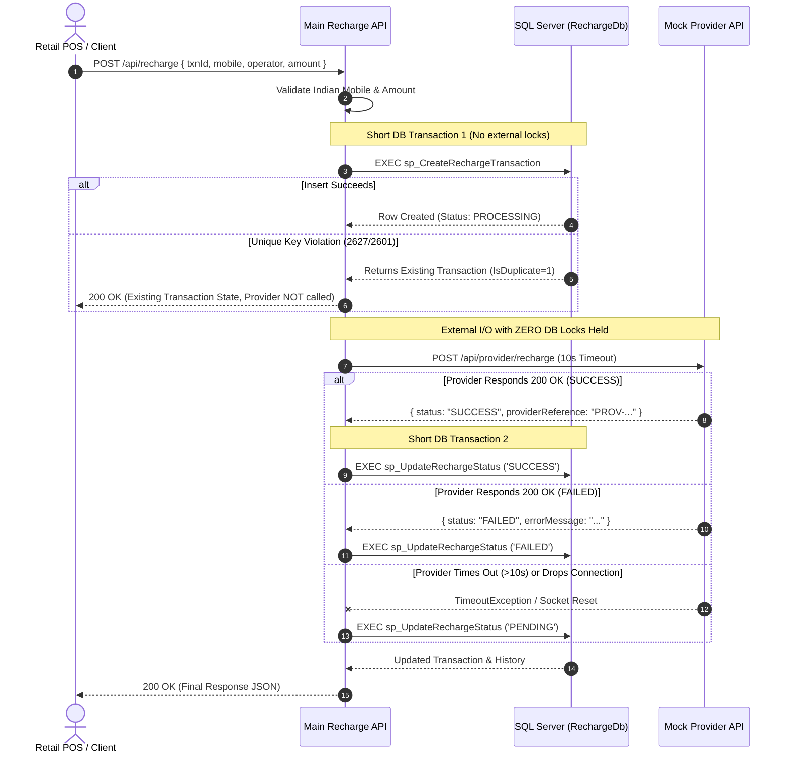

# Telecom Prepaid Recharge Platform (India POS)

A complete, production-grade telecom prepaid recharge platform engineered for retail/POS companies in India. The solution is built with ASP.NET Core 8 Web API, Microsoft SQL Server (raw T-SQL stored procedures called via Dapper & ADO.NET), high-throughput CSV voucher batch import using `SqlBulkCopy`, and a clean POS-style React + TypeScript frontend.

---

## Table of Contents
1. [Architecture Overview](#1-architecture-overview)
2. [Database Design & Schema (ERD)](#2-database-design--schema-erd)
3. [Recharge Transaction Flow](#3-recharge-transaction-flow)
4. [Critical Concurrency: Zero DB Transaction Hold Over External I/O](#4-critical-concurrency-zero-db-transaction-hold-over-external-io)
5. [Duplicate Prevention: Direct Insert & SQL Error Catching](#5-duplicate-prevention-direct-insert--sql-error-catching)
6. [Provider Simulation Matrix, Timeout Handling & Reconciliation](#6-provider-simulation-matrix-timeout-handling--reconciliation)
7. [High-Throughput CSV Card/Voucher Bulk Ingestion (10,000+ Rows)](#7-high-throughput-csv-cardvoucher-bulk-ingestion-10000-rows)
8. [Atomic Card Reservation (Concurrency Safety)](#8-atomic-card-reservation-concurrency-safety)
9. [Authentication, Logging & Error Handling](#9-authentication-logging--error-handling)
10. [Local Development Setup](#10-local-development-setup)
11. [Production Deployment to IIS](#11-production-deployment-to-iis)
12. [Postman Collection & Required Demo Scenario](#12-postman-collection--required-demo-scenario)

---

## 1. Architecture Overview

The system consists of three decoupled components:
1. **Main Recharge API (`RechargeApi` - Port 5000)**:
   - Core transaction engine handling request validation, state management, duplicate defense, and background reconciliation.
   - Communicates with SQL Server using raw T-SQL stored procedures through Dapper/ADO.NET.
2. **Mock Telecom Provider API (`MockProviderApi` - Port 5005)**:
   - Simulates downstream telecom operator core switch behavior (instant success, simulated failure, 15s latency timeouts, connection drops, and HTTP 500 crashes).
   - Provides a status enquiry endpoint as the reconciliation source of truth.
3. **Retail POS Frontend (`frontend` - Port 5173)**:
   - React + TypeScript (Vite) internal tool interface for executing recharges, viewing live transactions, running reconciliation rechecks, uploading CSV vouchers, and running analytical queries.

```
+-------------------------------------------------------------+
|                     React + TypeScript POS                  |
|                 (Port 5173 / Internal Tool)                 |
+------------------------------+------------------------------+
                               | HTTP (X-Api-Key)
                               v
+-------------------------------------------------------------+
|                 Main Recharge API (Port 5000)               |
|  - Concurrency Duplicate Guard (Catch 2627/2601)             |
|  - Zero DB Transaction Hold Over External I/O               |
|  - 10s Client-Side Timeout with PENDING State Transition    |
|  - Background Hosted Service Reconciliation Poller          |
|  - SqlBulkCopy CSV Ingestion Engine                         |
+---------------+-----------------------------+---------------+
                |                             |
     Dapper / ADO.NET (SP Calls)       HTTP (10s Timeout)
                |                             |
                v                             v
+-------------------------------+  +--------------------------+
|      Microsoft SQL Server     |  |    Mock Telecom Provider |
|  - TelecomOperators           |  |         (Port 5005)      |
|  - RechargeTransactions (UQ)  |  |  - ₹100 -> Success       |
|  - TransactionStatusHistory   |  |  - ₹200 -> Failed        |
|  - RechargeCards (Vouchers)   |  |  - ₹300 -> 15s Timeout   |
|  - Staging_RechargeCards      |  |  - ₹400 -> Drop Socket   |
|  - CardImportBatches          |  |  - ₹500 -> HTTP 500      |
+-------------------------------+  +--------------------------+
```

---

## 2. Database Design & Schema (ERD)

The database schema (`RechargeDb`) uses strict constraints, unique clustered/non-clustered indexes, and explicit foreign keys without relying on heavyweight ORMs:



---

## 3. Recharge Transaction Flow

Every mobile recharge request undergoes a strict 5-stage lifecycle:
1. **Validation**: Checks 10-digit Indian format (`^[6-9]\d{9}$`), positive decimal amount, and active operator (`Jio`, `Airtel`, `Vi`, `BSNL`).
2. **Initial DB Transaction (PROCESSING)**: Executes stored procedure `sp_CreateRechargeTransaction`. Direct `INSERT` into `RechargeTransactions` and `TransactionStatusHistory` (`NEW -> PROCESSING`).
3. **Commit & Close DB Connection**: The database transaction is committed immediately and the connection is closed.
4. **Outbound Provider Call**: Dispatches HTTP POST to `http://localhost:5005/api/provider/recharge` with a strict **10-second client timeout** via `CancellationTokenSource`. Audit logs are recorded in `ProviderRequests` and `ProviderResponses`.
5. **Final DB Transaction**: Opens a new, short database transaction calling `sp_UpdateRechargeStatus` to record the terminal or pending status (`SUCCESS`, `FAILED`, or `PENDING`) and log the state transition in `TransactionStatusHistory`.



---

## 4. Critical Concurrency: Zero DB Transaction Hold Over External I/O

> [!IMPORTANT]
> **Why we NEVER hold a SQL transaction open during an external HTTP call:**
> 1. **Connection Pool Starvation**: External network calls can take 5, 10, or 30 seconds. If a database transaction remains open while waiting for a remote HTTP response, a connection from the ADO.NET connection pool is pinned and unavailable to other threads. Under high POS traffic (e.g., 500 req/sec), the pool is exhausted within seconds, bringing down the entire API.
> 2. **Locking & Blocking Contention**: Open DB transactions maintain row and page locks (or key-range locks). Other queries attempting to read or update related customer or transaction data are blocked, causing cascading query timeouts.
> 3. **Worker Thread Exhaustion & Deadlocks**: Network latency fluctuations would propagate directly into database locks, drastically increasing deadlock frequency.
>
> **Our Solution**:
> - Transaction 1: Insert record in `PROCESSING` status (`NEW -> PROCESSING`) and **COMMIT immediately** (< 3ms).
> - External Call: Dispatched with zero open DB transactions.
> - Transaction 2: Open a new short transaction to record the final status (`SUCCESS`, `FAILED`, `PENDING`) and **COMMIT immediately** (< 2ms).

---

## 5. Duplicate Prevention: Direct Insert & SQL Error Catching

Instead of vulnerable `SELECT-THEN-INSERT` logic (which creates race conditions when two identical requests hit the server concurrently), the platform uses **database unique constraints**:

```sql
-- Inside sp_CreateRechargeTransaction:
BEGIN TRY
    BEGIN TRANSACTION;
    INSERT INTO dbo.RechargeTransactions (TransactionId, MobileNumber, OperatorId, Amount, Status, ...)
    VALUES (@TransactionId, @MobileNumber, @OperatorId, @Amount, 'PROCESSING', ...);
    
    INSERT INTO dbo.TransactionStatusHistory (TransactionId, OldStatus, NewStatus, Remarks)
    VALUES (@TransactionId, 'NEW', 'PROCESSING', 'Transaction initialized');
    COMMIT TRANSACTION;

    SELECT t.*, CAST(0 AS BIT) AS IsDuplicate FROM dbo.RechargeTransactions t ...;
END TRY
BEGIN CATCH
    IF @@TRANCOUNT > 0 ROLLBACK TRANSACTION;
    -- Catch SQL Error 2627 (Unique Constraint) or 2601 (Duplicate Index)
    IF ERROR_NUMBER() IN (2627, 2601)
    BEGIN
        SELECT t.*, CAST(1 AS BIT) AS IsDuplicate FROM dbo.RechargeTransactions t ...;
    END
    ELSE
    BEGIN
        THROW;
    END
END CATCH
```

When concurrent identical requests arrive simultaneously:
- Request A executes the insert and proceeds to call the provider.
- Request B triggers SQL Error 2627/2601, fetches the current record, and returns it to the client with `isDuplicate = true` **without invoking the provider a second time**.

---

## 6. Provider Simulation Matrix, Timeout Handling & Reconciliation

The `MockProviderApi` (Port 5005) simulates distinct downstream telco conditions based on the recharge amount:

| Amount (INR) | Provider Behavior | Expected Client Outcome |
| :--- | :--- | :--- |
| **₹100** | Immediate 200 OK `SUCCESS` | Transaction marked `SUCCESS` immediately |
| **₹200** | Immediate 200 OK `FAILED` (Insufficient balance) | Transaction marked `FAILED` with provider error message |
| **₹300** | 15-second delay before responding `SUCCESS` | Main API client timeout (10s) expires $\rightarrow$ Transaction marked `PENDING` |
| **₹400** | Records `SUCCESS` internally, then aborts socket connection (`HttpContext.Abort()`) | Main API catches connection reset $\rightarrow$ Transaction marked `PENDING` |
| **₹500** | Immediate HTTP 500 Internal Server Error | Main API handles 500 cleanly $\rightarrow$ Transaction marked `FAILED` |
| **Any other (e.g. ₹299)** | Immediate 200 OK `SUCCESS` | Default happy path |

### Reconciliation Path
Transactions in `PENDING` state are automatically and manually recoverable:
1. **Automatic Background Reconciliation**: `RechargeReconciliationBackgroundService` polls `PENDING` transactions every 20 seconds, queries `GET /api/provider/status/{referenceId}`, and promotes them to `SUCCESS` or `FAILED`.
2. **Manual POS Recheck**: Users can click the **"Recheck"** button in the frontend or execute `POST /api/recharge/{transactionId}/reconcile` to perform an immediate status query.

---

## 7. High-Throughput CSV Card/Voucher Bulk Ingestion (10,000+ Rows)

For importing batches of 10,000+ scratch cards/e-vouchers:
1. **Streaming CSV Parsing**: Fast stream parsing with line-by-line syntax validation.
2. **`SqlBulkCopy` to Staging**: Ingests raw rows directly into `dbo.Staging_RechargeCards` in bulk batches of 5,000 rows (< 250ms for 10,000 rows).
3. **Set-Based Merge (`sp_ProcessStagingCards`)**:
   - Validates telco operator IDs against `TelecomOperators`.
   - Validates positive denomination values and date formatting.
   - Detects intra-file duplicate card numbers and serial numbers using `ROW_NUMBER() OVER (PARTITION BY CardNumber)`.
   - Detects database duplicates against existing records in `RechargeCards`.
   - Bulk inserts valid cards into `RechargeCards` in a single set-based statement.
   - Updates `CardImportBatches` with total, successful, failed, and duplicate counts.
4. **Partial Success**: Malformed rows are rejected with row numbers and specific reasons (e.g., `Row 15 - Duplicate CardNumber`) without rolling back valid records.

---

## 8. Atomic Card Reservation (Concurrency Safety)

To prevent voucher double-spending under high concurrency, card reservation uses a single atomic SQL statement with the `OUTPUT` clause:

```sql
UPDATE dbo.RechargeCards
SET Status = 'RESERVED',
    UsedTransactionId = @TransactionId,
    ReservedDate = SYSUTCDATETIME(),
    UpdatedDate = SYSUTCDATETIME()
OUTPUT 
    INSERTED.Id,
    INSERTED.CardNumber,
    INSERTED.SerialNumber,
    INSERTED.Denomination,
    INSERTED.ExpiryDate,
    INSERTED.Status
WHERE CardNumber = @CardNumber 
  AND Status = 'AVAILABLE';
```

If two threads attempt to reserve the same card concurrently:
- Thread 1 updates 1 row and receives the reserved entity.
- Thread 2 matches 0 rows (since `Status` is no longer `'AVAILABLE'`) and receives a `409 Conflict`.

---

## 9. Authentication, Logging & Error Handling

- **Authentication**: Custom ASP.NET Core `ApiKeyMiddleware` inspecting the `X-Api-Key` header. Configured via `RECHARGE_API_KEY` environment variable. Returns `401 Unauthorized` JSON. The API key is **never written to logs**.
- **Structured Logging**: Configured via Serilog with both Console and Daily Rolling File sinks (`logs/RechargeApi-.log`). Logs include incoming payloads, transaction IDs, latency ms, provider HTTP status, timeouts, and state transitions.
- **Global Error Handling**: `GlobalExceptionHandlerMiddleware` captures all unhandled exceptions and produces uniform JSON error payloads.

---

## 10. Local Development Setup

### Prerequisites
- Windows 10/11
- .NET 8 SDK
- Microsoft SQL Server (Local instance `localhost` or Express)
- Node.js 18+ and npm

### 1. Database Setup
Open PowerShell in the project directory and execute:
```powershell
sqlcmd -S localhost -E -C -i "database\01_schema.sql" -i "database\02_stored_procedures.sql" -i "database\03_indexes_constraints.sql" -i "database\04_seed_data.sql"
```

### 2. Run Mock Telecom Provider API
```powershell
cd src\MockProviderApi
dotnet run
# Runs at http://localhost:5005
```

### 3. Run Main Recharge API
```powershell
cd src\RechargeApi
dotnet run
# Runs at http://localhost:5000
# Swagger UI available at http://localhost:5000/swagger
```

### 4. Run React POS Frontend
```powershell
cd frontend
npm install
npm run dev
# Runs at http://localhost:5173
```

---

## 11. Production Deployment to IIS

### Step 1: Install Prerequisites on Windows Server
1. Enable **Internet Information Services (IIS)** with Web Server features.
2. Install the **.NET 8 Hosting Bundle** (includes the ASP.NET Core Module `AspNetCoreModuleV2` for IIS).

### Step 2: Publish the ASP.NET Core APIs
```powershell
# Publish Main Recharge API
dotnet publish src\RechargeApi\RechargeApi.csproj -c Release -o C:\inetpub\wwwroot\RechargeApi

# Publish Mock Provider API
dotnet publish src\MockProviderApi\MockProviderApi.csproj -c Release -o C:\inetpub\wwwroot\MockProviderApi
```

### Step 3: Configure IIS Application Pools
1. Open IIS Manager (`inetmgr`).
2. Create an Application Pool named `RechargeApiAppPool`:
   - **.NET CLR Version**: Select **No Managed Code** (ASP.NET Core runs out-of-process via Kestrel).
   - **Managed Pipeline Mode**: Integrated.
   - **Identity**: `ApplicationPoolIdentity` (or dedicated service account with SQL Server permissions).
3. Create an Application Pool named `MockProviderAppPool` with **No Managed Code**.

### Step 4: Create IIS Sites / Applications
1. Add Site `RechargeApi`:
   - Binding: Port 5000 (or desired domain).
   - Physical Path: `C:\inetpub\wwwroot\RechargeApi`.
   - Assign to `RechargeApiAppPool`.
2. Add Site `MockProviderApi`:
   - Binding: Port 5005.
   - Physical Path: `C:\inetpub\wwwroot\MockProviderApi`.
   - Assign to `MockProviderAppPool`.

### Step 5: Configure Production Settings & Secrets
- Configure connection strings and API keys via `appsettings.Production.json` or IIS Environment Variables:
  - `ConnectionStrings__DefaultConnection`: `Server=SQLPROD01;Database=RechargeDb;Integrated Security=SSPI;TrustServerCertificate=True;`
   - `Auth__ApiKey`: `your_production_api_key`
- **Logs Location**: Serilog writes rolling files to `C:\inetpub\wwwroot\RechargeApi\logs\RechargeApi-YYYYMMDD.log`. Ensure the IIS AppPool user has Write permissions to the `logs` folder.

---

## 12. Postman Collection & Required Demo Scenario

The Postman collection is located at [`postman/RechargePlatform.postman_collection.json`](file:///d:/project/RechargePlatform/postman/RechargePlatform.postman_collection.json).

### Required Demo: Concurrency Duplicate Scenario
To verify that duplicate requests do NOT trigger multiple provider calls:
1. Open Postman or execute two concurrent requests using PowerShell:
   ```powershell
   $body = '{"transactionId":"TXN900001","mobileNumber":"9876543210","operator":"Airtel","amount":299}'
   $headers = @{ "X-Api-Key" = $env:RECHARGE_API_KEY; "Content-Type" = "application/json" }

   # Fire request 1
   Invoke-RestMethod -Uri "http://localhost:5000/api/recharge" -Method Post -Body $body -Headers $headers
   # Fire request 2 with identical transactionId
   Invoke-RestMethod -Uri "http://localhost:5000/api/recharge" -Method Post -Body $body -Headers $headers
   ```
2. **Verification in SQL Server**:
   ```sql
   -- Verify exactly ONE provider request audit was logged for TXN900001:
   SELECT COUNT(*) AS ProviderCallCount 
   FROM dbo.ProviderRequests 
   WHERE TransactionId = 'TXN900001';
   -- Returns: 1

   -- Verify transaction status in RechargeTransactions:
   SELECT TransactionId, Status, ProviderReference 
   FROM dbo.RechargeTransactions 
   WHERE TransactionId = 'TXN900001';
   -- Returns: TXN900001 | SUCCESS | PROV-...
   ```
